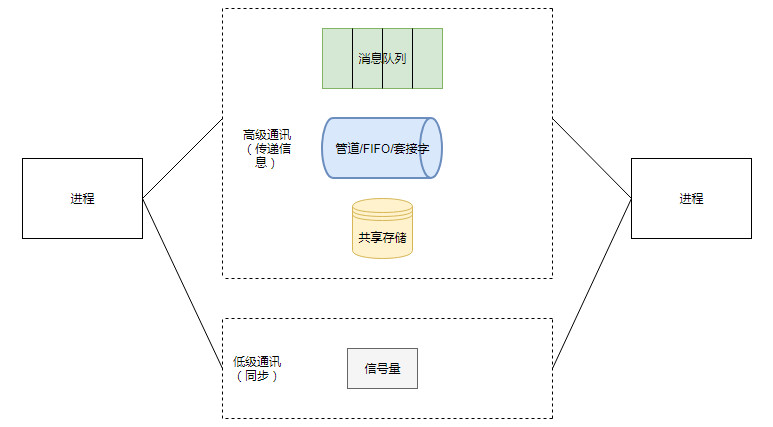
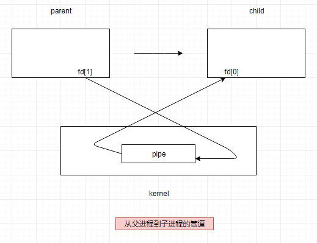
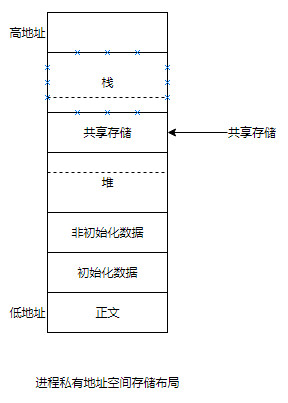

# os summary
秋招复习，对操作系统常问的问题总结。

<!-- GFM-TOC -->
* [进程与线程的区别](#进程与线程的区别)
* [进程之间的通信](#进程之间的通信)
* [进程控制](#进程控制)
<!-- GFM-TOC -->

## 进程与线程的区别
### 1. 进程
进程是一个执行中程序的实例，系统中每个程序都是运行在某个进程的上下文中的，上下文是由所需状态组成，包括：程序的代码和数据、堆及用户栈、环境变量、打开文件描述符等。是系统进行资源分配和调度的一个独立单位。

### 2. 线程
线程是独立调度的基本单位。一个进程中可以有多个线程，至少有一个线程，它们共享进程资源。

### 3. 区别
- 调度：线程是调度资源的基本单位。在同一进程中，线程的切换不会引起进程切换，从一个进程内的线程切换到另一个进程中的线程时，会引起进程切换。

- 拥有资源：进程是拥有资源的基本单位，线程不拥有资源，线程可以访问隶属进程的资源，包括：程序的代码和数据、堆及用户栈、环境变量、打开文件描述符等。

- 系统开销：由于创建或撤销进程时，系统都要为之分配或回收资源，如内存空间、I/O 设备等，所付出的开销远大于创建或撤销线程时的开销。类似地，在进行进程切换时，涉及当前执行进程 CPU 环境的保存及新调度进程 CPU 环境的设置，而线程切换时只需保存和设置少量寄存器内容，开销很小。

- 通信方面：进程间通信 (IPC) 需要进程同步和互斥手段的辅助，以保证数据的一致性。而线程间可以通过直接读/写同一进程中的数据段（如全局变量）来进行通信。

举例：QQ 和浏览器是两个进程，浏览器进程里面有很多线程，例如 HTTP 请求线程、事件响应线程、渲染线程等等，线程的并发执行使得在浏览器中点击一个新链接从而发起 HTTP 请求时，浏览器还可以响应用户的其它事件。

## 进程之间的通信

  
 

### 1. 管道
用于连接一个读进程和一个写进程以实现以它们之间通信的一个共享文件，又名pipe文件。

特点：
* 它们是半双工的（即数据只能在一个方向上流动）
* 一般在父子进程中使用，一个管道由一个进程创建，接着调用fork，此后父子进程间就可应用管道通信。

函数：
~~~c
# include <unistd.h>
int pipe(int fileds[2]);
~~~

例子：
~~~c
int
main(void)
{
    int n;
    int fd[2];
    pid_t pid;
    char line[MAXLINE];

    if (pipe[fd] < 0)
        err_sys("pipe error");
    if ((pid = fork()) < 0) {
        err_sys("fork error");
    } else if (pid > 0) {
        close(fd[0]);
        write(fd[1], "hello world\n", 12);
    } else {
        close(fd[1]);
        n = read(fd[0], line, MAXLINE);
        write(STDOUT_FILENO, line, n);
    }

exit(0);
}
~~~
管道是通过调用 pipe 函数创建的，fd[0] 用于读，fd[1] 用于写。

  
 

  
 

### 2. FIFO
FIFO是一种文件类型，也称为命名管道，一般的文件I/O函数都可应用于FIFO。

特点：
去除了管道只能在父子进程中使用的限制，不相关的进程也能交换数据。

函数：
~~~c
#include <sys/stat.h>
int mkfifo(const char *path, mode_t mode);
~~~

  
 

### 3. 套接字
套接字网络IPC接口，可以用于计算机间通信，又可以用于计算机内通信，进程能够使用该接口和其他进程通信。

RPC是使用套接字实现的一种高级进程通信方式。

基于字符流的进程通信规约

  
 

### 4. 消息队列
消息队列是消息的链接表，存放在内核中并由消息队列标识符标识。

相比于 FIFO，消息队列具有以下优点：
* 消息队列可以独立于读写进程存在，从而避免了 FIFO 中同步管道的打开和关闭时可能产生的困难；
* 避免了 FIFO 的同步阻塞问题，不需要进程自己提供同步方法；
* 读进程可以根据消息类型有选择地接收消息，而不像 FIFO 那样只能默认地接收。

### 5. 共享存储
允许多个进程共享一个给定的存储区。因为数据不需要在进程之间复制，所以这是最快的一种 IPC。

  
 

需要使用信号量用来同步对共享存储的访问。

多个进程可以将同一个文件映射到它们的地址空间从而实现共享内存。另外 XSI 共享内存不是使用文件，而是使用使用内存的匿名段。

### 6. 信号量
它是一个计数器，用于为多个进程提供对共享数据对象的访问。

## 进程控制
每个进程都有一个唯一的正数（非零）进程ID（PID）。getpid函数返回进程PID，getppid函数返回父进程的PID。

### fork()
父进程通过调用fork函数来创建一个新的运行子进程。

函数定义：
~~~c
#include <unistd.h>
#include <sys/types.h>
pid_t fork(void);
// 执行失败返回-1
~~~

例子：
~~~c
int main()
{
    pid_t = pid;
    int x = 1;

    pid = Fork();
    if (pid == 0) { /*child*/
        printf("child: x=%d\n", ++x);
        exit(0);
    }

    /*parent*/
    printf("parent: x=%d\n", --x);
    exit(0);
}

结果：
parent: x=0
child:  x=2
~~~

执行该函数后会有一些微妙的方面：
* fork函数被父进程调用一次，但是却返回两次。一次是返回到父进程，返回子进程pid，一次是返回到新创建的子进程，返回0。看到这里也许会想，为什么会返回两次且值还不同？原因就是，执行fork函数后进行了系统调用，为子进程分配了和父进程相同的地址空间的拷贝，此时程序寄存器pc，在父、子进程的上下文中都声称，这个进程目前执行到fork调用即将返回，根据操作系统对fork函数的实现，使得父进程返回子进程PID（因为有多个子进程），子进程返回0（子进程只要一个父进程）。（参考：https://blog.csdn.net/barfoo/article/details/1626938）
* 并发执行。父进程和子进程是并发运行的独立进程。内核能够以任意方式交替执行它们逻辑控制流中的指令。
* 相同但是独立的地址空间。
* 共享文件。执行程序示例时，父进程和子进程都输出在屏幕上。原因是子进程继承了父进程所打开的文件即文件描述符，stdout文件是打开的，执行屏幕，因此，子进程的输出也是指向屏幕。

fork失败的原因：
* 系统中有太多的进程，超过了系统限制。

fork的应用：
* 父进程复制自己，使父子进程执行不同的代码段。网络服务进程中，父进程等待请求，调用fork，使子进程执行，父进程继续等待请求。
* 一个进程要执行一个不同的程序。shell。

进程图：

  
 

### waitpid()
一个进程可以通过调用waitpid函数来等待它的子进程终止或者暂停。

当一个进程由于某种原因终止时，内核并不是立即把它从系统中清除。取而代之的是，进程被保持在一种终止状态，直到被它的父进程回收。当父进程回收已终止的子进程时，内核将子进程的退出状态传递给父进程，然后抛弃已终止的进程，该进程到此就不存在了。

ps：回收时的几种情况：
* 僵死进程：一个终止了但还未被回收的进程称为僵死进程。
* 孤儿进程：一个父进程退出，而它的一个或多个子进程还在运行，那么那些子进程将成为孤儿进程。孤儿进程将被init进程(进程号为1)所收养，并由init进程对它们完成状态收集工作。

如果大量的产生僵死进程，将因为没有可用的进程号而导致系统不能产生新的进程。

函数定义：
~~~c
#include <sys/types.h>
#include <sys/wait.h>
pid_t waitpid(pid_t pid, int *status, int options);
~~~

waitpid挂起调用进程的执行，直到它的等待集合中的一个子进程终止。如果等待集合中的一个进程刚调用的时刻就终止了，那么waitpid立即返回。上述情况，waitpid都返回终止进程的pid，且将其从子进程中去除。

参数pid的意义：
* 如果pid > 0,那么等待集合就是一个单独的子进程。
* 如果pid = -1,那么等待集合就是父进程的所有子进程。

ps：wait与waitpid的区别：
* 系统调用waitpid和wait的作用是完全相同的，但waitpid多出了两个可由用户控制的参数pid和options，从而为我们编程提供了另一种更灵活的方式。

### sleep()
sleep函数将一个进程挂起一段时间，sleep返回0，或者返回剩下要休眠的秒数。

函数定义：
~~~c
#include <unistd.h>
unsigned int sleep(unsigned int secs);
~~~

### 加载并运行程序
fork函数创建子进程后，子进程往往要调用一种exec函数以执行另一个程序。当进程调用一种exec函数时，该进程执行的程序完全替换为新程序，新程序从main函数开始执行。exec只是用一个全新的程序替换了当前进程的正文、数据、堆和栈。

execve函数在当前进程的上下文加载并运行一个新程序，是exec的6种不同函数之一。

函数定义：
~~~c
#include <unistd.h>
int execve(char *filename, char *argv[], char *envp[]);
~~~

execve函数加载并运行可执行目标文件filename，且带参数列表argv和环境列表envp。除非出现错误，否则该函数从不返回。

Unix shell和web服务器这样的程序大量使用了fork和execve函数。shell是一个交互型的应用程序，它代表用户运行其他程序。

## 进程调度算法
https://github.com/CyC2018/Interview-Notebook/blob/master/notes/%E8%AE%A1%E7%AE%97%E6%9C%BA%E6%93%8D%E4%BD%9C%E7%B3%BB%E7%BB%9F.md#%E8%BF%9B%E7%A8%8B%E8%B0%83%E5%BA%A6%E7%AE%97%E6%B3%95

## 页面置换算法
先介绍一些页式存储管理相关的概念。

页式存储管理采用离散分配的方式，离散分配的基本单位是页，称为分页式存储管理。

### 页面
一个进程的逻辑地址空间分成若干个大小相等的片，称为页面或页。
把内存空间分成与页面相同大小的若干个存储块，称为块或页架。
最后一页经常装不满，会产生页内碎片。
页面太小，减少业内碎片，提高内存利用率，降低页面换进换出效率，占用大量内存；页面太大，提高页面换进换出速度，但业内碎片增大。

### 地址结构

  
 
地址转换的例子：https://blog.csdn.net/douyuan888/article/details/9215053

### 页表
页号和物理块号对应的表，存放在主存/内存中，进行地址转换的时候CPU需要访问两次主存/内存。快表可以提高页面的访问速度。

### 页式虚拟存储管理的基本思想
把进程全部页面装入虚拟存储器，执行时先把部分页面装入实际内存，然后根据执行行为，动态调入不在主存的页，同时进行必要的页面调出。
首次只把进程的第一页信息装入主存，称为请求式存储管理。

### 页面置换算法
https://github.com/CyC2018/Interview-Notebook/blob/master/notes/%E8%AE%A1%E7%AE%97%E6%9C%BA%E6%93%8D%E4%BD%9C%E7%B3%BB%E7%BB%9F.md#%E9%A1%B5%E9%9D%A2%E7%BD%AE%E6%8D%A2%E7%AE%97%E6%B3%95
